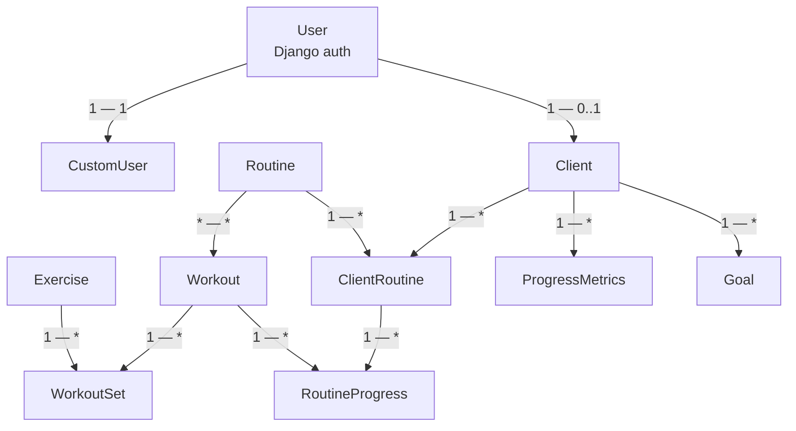
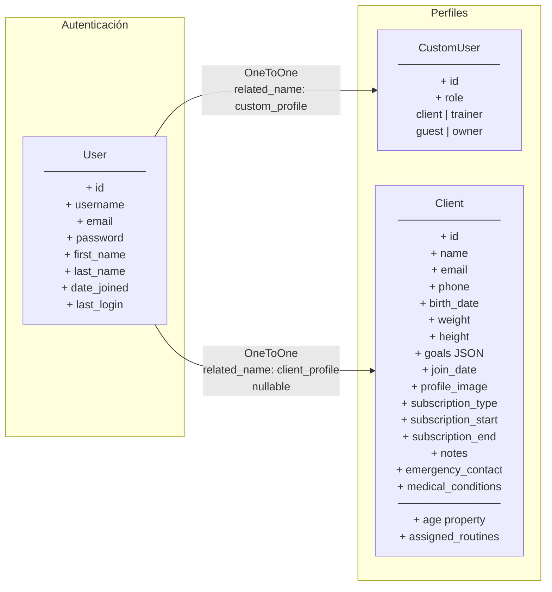
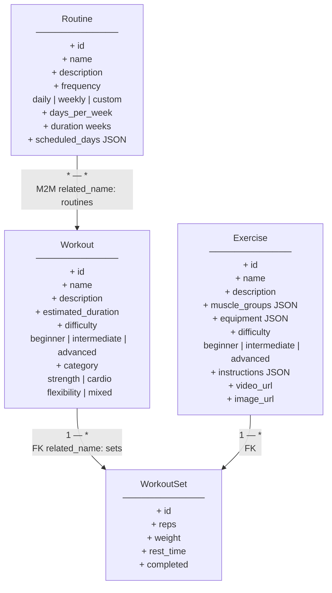
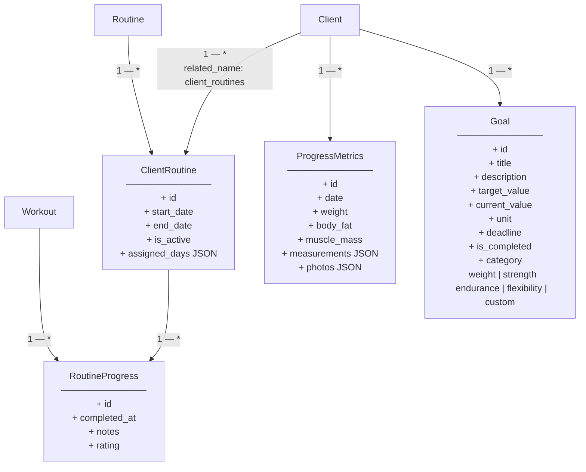
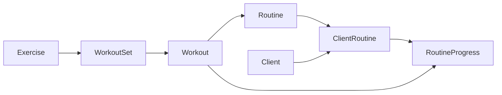

# Diagrama de Clases — Gym Now

Documentación visual de las entidades del dominio definidas en `gym/models.py`, representada con diagramas Mermaid (`flowchart`).

## Resumen de entidades

| Entidad | Descripción |
|---|---|
| `User` | Usuario base de Django (`auth.User`) |
| `CustomUser` | Perfil de rol asociado a un `User` |
| `Client` | Cliente del gimnasio (perfil de negocio) |
| `Exercise` | Ejercicio individual del catálogo |
| `Workout` | Entrenamiento compuesto por sets |
| `WorkoutSet` | Serie de un ejercicio dentro de un workout |
| `Routine` | Rutina que agrupa workouts |
| `ClientRoutine` | Asignación de rutina a un cliente |
| `RoutineProgress` | Registro de progreso de un workout en una asignación |
| `ProgressMetrics` | Métricas corporales del cliente |
| `Goal` | Objetivo personal del cliente |

---

## 1. Vista general de relaciones

---

## 2. Dominio de usuarios y clientes

---

## 3. Dominio de entrenamiento

---

## 4. Dominio de asignación y progreso

---

## 5. Flujo de composición de una rutina

Desde el catálogo hasta la ejecución por el cliente:

---

## Cardinalidades

| Relación | Tipo | Cardinalidad |
|---|---|---|
| `User` → `CustomUser` | OneToOne | 1 — 1 |
| `User` → `Client` | OneToOne (nullable) | 1 — 0..1 |
| `Client` → `ClientRoutine` | ForeignKey | 1 — * |
| `Routine` → `ClientRoutine` | ForeignKey | 1 — * |
| `Routine` ↔ `Workout` | ManyToMany | * — * |
| `Workout` → `WorkoutSet` | ForeignKey | 1 — * |
| `Exercise` → `WorkoutSet` | ForeignKey | 1 — * |
| `ClientRoutine` → `RoutineProgress` | ForeignKey | 1 — * |
| `Workout` → `RoutineProgress` | ForeignKey | 1 — * |
| `Client` → `ProgressMetrics` | ForeignKey | 1 — * |
| `Client` → `Goal` | ForeignKey | 1 — * |

---

## Notas

- `CustomUser` se crea automáticamente al guardar un `User` (signal `post_save`).
- Al crear un `Client` sin usuario asociado, se genera un `User` con username = email y contraseña por defecto basada en la edad (`{edad}00`).
- `Client.goals` es un JSON de textos libres; la entidad `Goal` modela objetivos estructurados con progreso medible.
- `Client.assigned_routines` es una property que expone las rutinas activas vía `ClientRoutine`.
