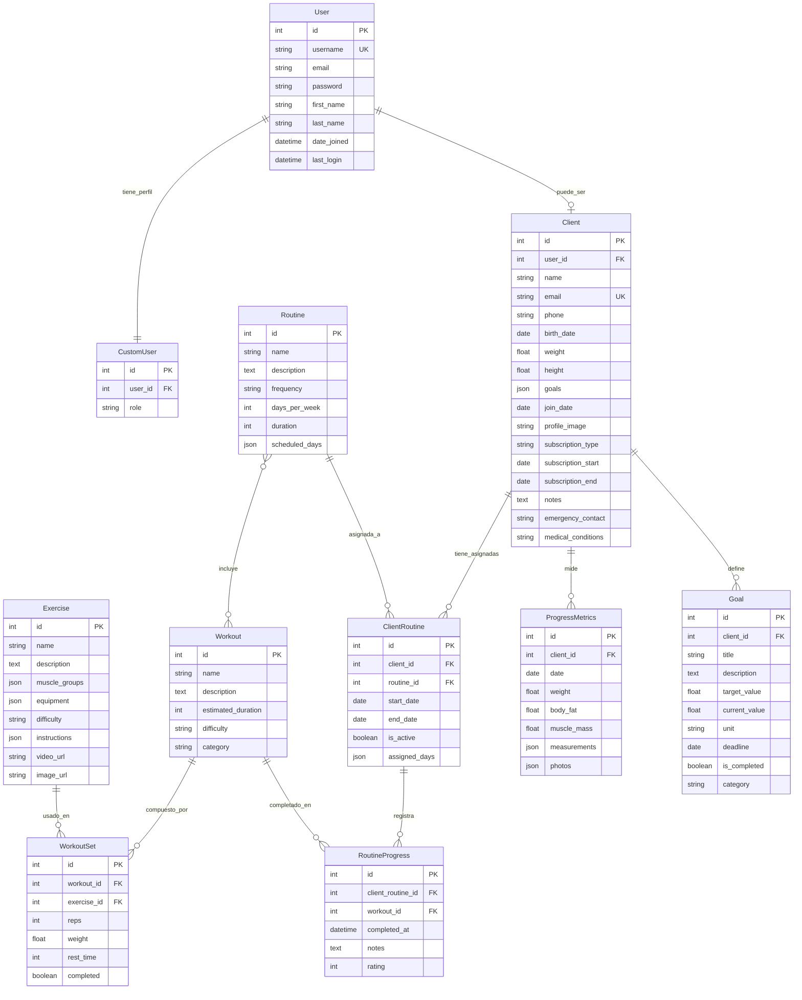
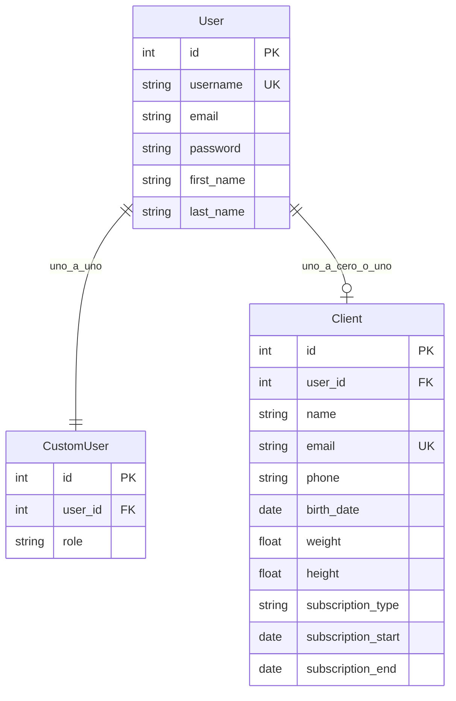
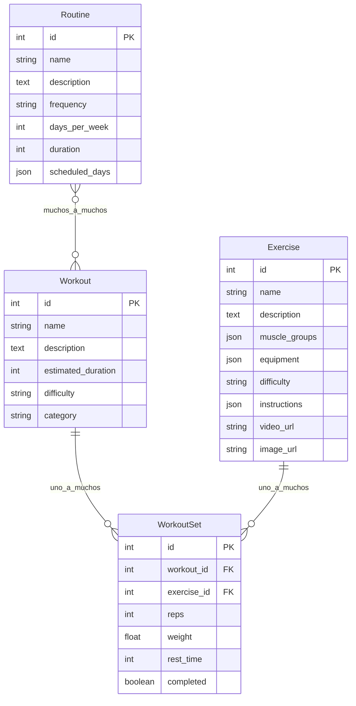
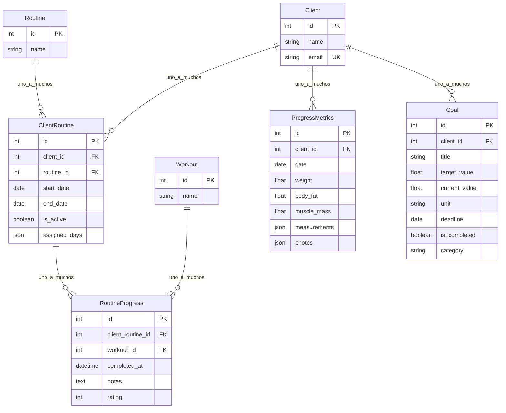

# Diagrama Entidad-Relación (ER) — Gym Now

Modelo relacional de las entidades definidas en `gym/models.py`, representado con diagramas Mermaid (`erDiagram`).

## Resumen

El esquema cubre tres áreas:

1. **Usuarios y clientes** — autenticación Django y perfiles de negocio
2. **Catálogo de entrenamiento** — ejercicios, workouts, sets y rutinas
3. **Asignación y seguimiento** — rutinas del cliente, progreso, métricas y objetivos

---

## 1. Diagrama ER completo

---

## 2. Dominio de usuarios y clientes

`CustomUser.user_id` y `Client.user_id` son Unique (OneToOne). `Client.user_id` puede ser null.

---

## 3. Dominio de entrenamiento

> La relación M:N entre `Routine` y `Workout` se materializa en Django como tabla intermedia automática (`routine_workouts`).

---

## 4. Dominio de asignación y seguimiento

---

## 5. Diccionario de relaciones

| Entidad origen | Entidad destino | Cardinalidad | Tipo / implementación | On delete |
|---|---|---|---|---|
| `User` | `CustomUser` | 1:1 | OneToOne (`user_id` UK) | CASCADE |
| `User` | `Client` | 1:0..1 | OneToOne nullable (`user_id` UK) | CASCADE |
| `Client` | `ClientRoutine` | 1:N | ForeignKey | CASCADE |
| `Routine` | `ClientRoutine` | 1:N | ForeignKey | CASCADE |
| `Routine` | `Workout` | M:N | ManyToMany | — |
| `Workout` | `WorkoutSet` | 1:N | ForeignKey | CASCADE |
| `Exercise` | `WorkoutSet` | 1:N | ForeignKey | CASCADE |
| `ClientRoutine` | `RoutineProgress` | 1:N | ForeignKey | CASCADE |
| `Workout` | `RoutineProgress` | 1:N | ForeignKey | CASCADE |
| `Client` | `ProgressMetrics` | 1:N | ForeignKey | CASCADE |
| `Client` | `Goal` | 1:N | ForeignKey | CASCADE |

---

## 6. Claves y restricciones

| Tabla | PK | UK / índices lógicos | Notas |
|---|---|---|---|
| `User` | `id` | `username` | Modelo Django `auth_user` |
| `CustomUser` | `id` | `user_id` | Rol del usuario |
| `Client` | `id` | `email`, `user_id` | `phone` validado como único en `clean()` |
| `Exercise` | `id` | — | Catálogo global |
| `Workout` | `id` | — | Contenedor de sets |
| `WorkoutSet` | `id` | — | Une workout + exercise |
| `Routine` | `id` | — | Agrupa workouts |
| `ClientRoutine` | `id` | — | Asignación cliente ↔ rutina |
| `RoutineProgress` | `id` | — | Historial de ejecución |
| `ProgressMetrics` | `id` | — | Snapshot corporal por fecha |
| `Goal` | `id` | — | Objetivo medible del cliente |

---

## 7. Campos enumerados (choices)

| Entidad | Campo | Valores |
|---|---|---|
| `CustomUser` | `role` | `client`, `trainer`, `guest`, `owner` |
| `Client` | `subscription_type` | `standard`, `premium`, `personalized` |
| `Exercise` | `difficulty` | `beginner`, `intermediate`, `advanced` |
| `Workout` | `difficulty` | `beginner`, `intermediate`, `advanced` |
| `Workout` | `category` | `strength`, `cardio`, `flexibility`, `mixed` |
| `Routine` | `frequency` | `daily`, `weekly`, `custom` |
| `Goal` | `category` | `weight`, `strength`, `endurance`, `flexibility`, `custom` |

---

## Notas de modelado

- Todas las FKs usan `on_delete=CASCADE`: al eliminar el padre se eliminan los registros dependientes.
- `Client.user` es opcional; si se crea un cliente sin usuario, un signal crea el `User` automáticamente.
- `Client.goals` (JSON de textos) y la entidad `Goal` coexisten: el primero es lista libre; el segundo es seguimiento estructurado.
- Campos `JSONField` (`muscle_groups`, `equipment`, `instructions`, `scheduled_days`, `assigned_days`, `measurements`, `photos`) no se normalizan en tablas hijas.
